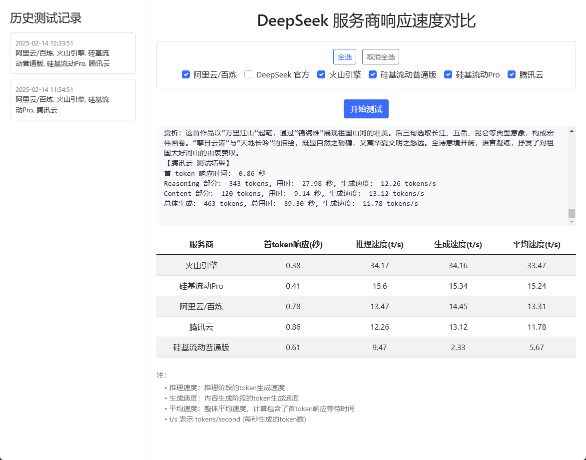

# DeepSeek API 速度测试工具
这是一个专门用于测试和对比不同 DeepSeek 大语言模型服务商性能的工具。通过这个工具，用户可以直观地比较各个服务商在首次响应时间、推理速度和内容生成速度等方面的表现。

## 测试结果示例

测试结果界面如下图所示：




## 功能特点

- 支持多个 DeepSeek API 服务商测试:
  - DeepSeek 官方
  - 阿里云/百炼
  - 硅基流动普通版 / Pro
  - 火山引擎
  - 腾讯云

- 详细的性能指标:
  - 首 token 响应时间
  - 推理阶段速度 (tokens/second)
  - 内容生成速度 (tokens/second)
  - 平均生成速度 (tokens/second)

- 实时测试日志显示
- 历史记录管理
- 响应式界面设计

## 安装说明

1. 克隆仓库:
```bash
git clone https://github.com/guangfuhao/deepseek-api-speed-test.git
cd deepseek-api-speed-test
```

2. 安装依赖:
推荐使用 Python 3.11.10

```bash
pip install -r requirements.txt
```


3. 配置环境变量:

修改 `.env.example` 文件为 `.env` 文件，并配置以下环境变量:

```
DEEPSEEK_API_KEY=your_deepseek_api_key
ALIYUN_API_KEY=your_aliyun_api_key
SILICONFLOW_API_KEY=your_siliconflow_api_key
HUOSHAN_API_KEY=your_huoshan_api_key
TENCENT_API_KEY=your_tencent_api_key
```


4. 运行应用:

```bash
python app.py
```

访问 `http://localhost:5000` 即可使用。

## 使用说明

1. 在主界面选择要测试的服务商(可多选)
2. 点击"开始测试"按钮
3. 等待测试完成,查看测试结果
4. 可在左侧边栏查看历史测试记录

## 技术栈

- 后端: Flask + SQLAlchemy
- 数据库: SQLite

## 贡献指南

欢迎提交 Issue 和 Pull Request 来帮助改进这个项目。

## 许可证

本项目采用 MIT 许可证 - 查看 [LICENSE](LICENSE) 文件了解详情

## 联系方式

如有任何问题或建议,欢迎联系:

- 项目作者: [Hao Guangfu]
- 邮箱: [real_hgf@163.com]
